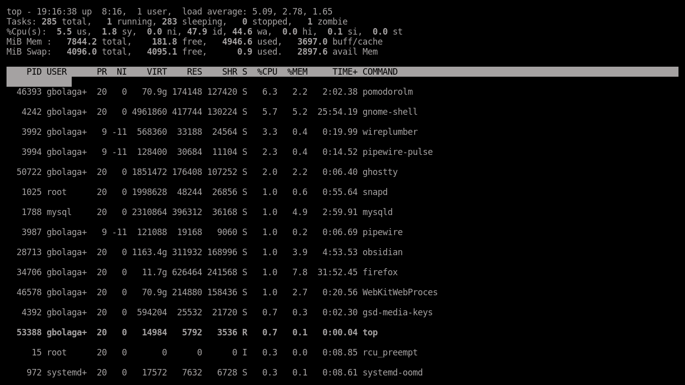
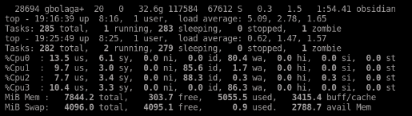
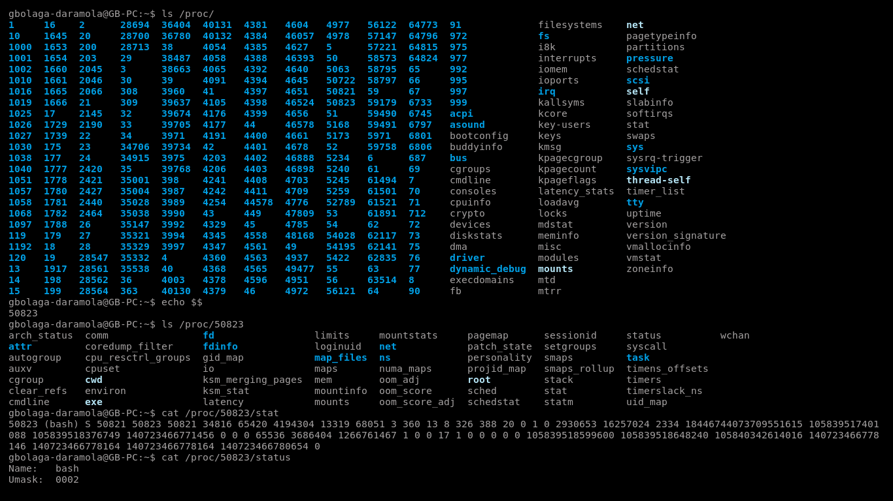
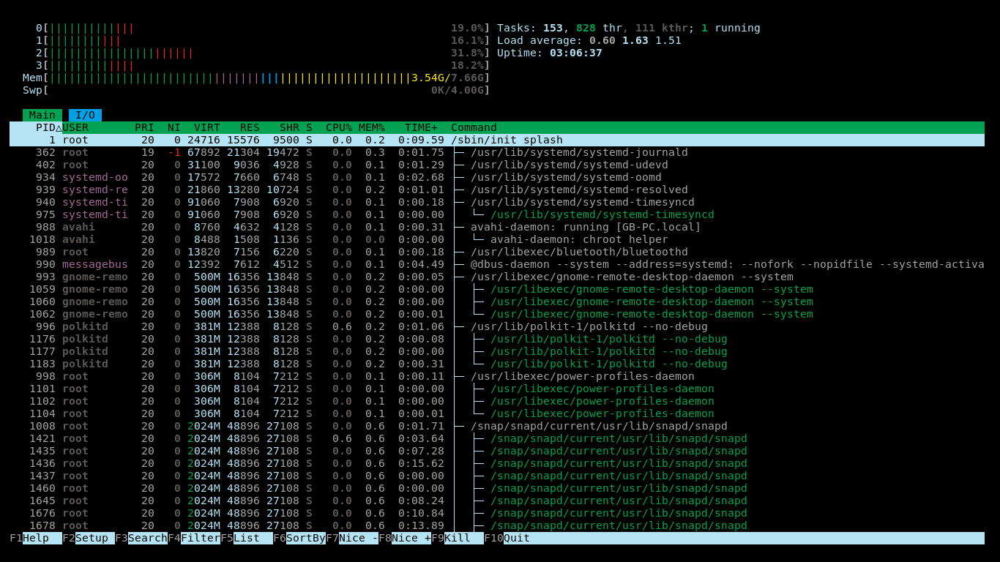
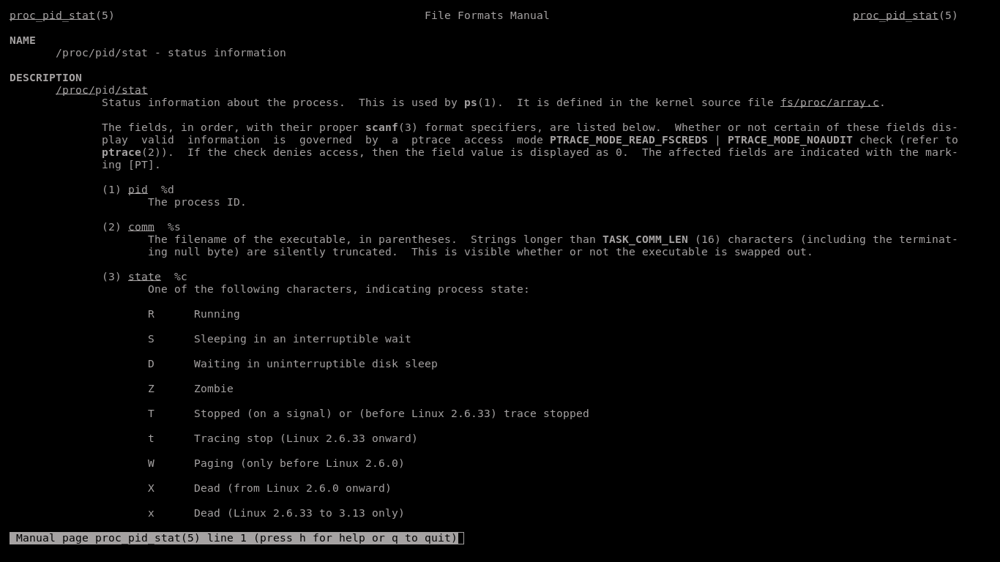

Today, I'm going to build a cli tool that tracks and displays real time resources of certain running task on my computer system.

Similar to the Top Cli tool on Linux. 

Here's how the Original cli looks :
- I'll work on the cpu process monitor

there's a zombie task there 😅 - what does that even mean?

interesting to find out what's happening at each cores in my system's CPU.

Now, Top only works due to the /proc directory on every Linux system. It's regularly reading information from there to be able to give an aggregated summary.

What then is in this /proc directory.

/proc is actually not a directory on the disk. It's a virtual filesystem (`procfs`) that is generated by the kernel on demand. 

I can recall from my yesterday's note, that the kernel is incharge of communications between the hardware and the Processes (Progams). it essentially manages them effectively.

Now, let's dig deep.

I can see lots of numbers in the proc (virtual filesystem).

I believe they are called PID (Process Identifier) directories with some systems files.

If the /proc is a virtual filesystem, what then are the process identifiers representing? 

A PID directory, represented by numbers, is a virtual directory that is dynamically (just means create when needed) which represents process that is currently running on the system.
wording...

This means, that once the process is completed they would be cleaned up and not show up on the procfs.

This is where I'll stop for today (2026-06-09)

---

Let's pick this up, today (2026-06-11)

Today, I'll go all in on the process monitor in Rust.

It's going to be written in Rust and will be benchmarked against top and htop. I'll write the tradeoffs as well.

The scope of the project:
- The tool should show a report of per process CPU utilization by reading the /proc files
	- It should also report aggregate and per-core  CPU stats by reading stats from the /proc virtual filesystem.
	- At a specified interval, the tool should sample the reported files, compute the deltas between samples to derive percentages, and print the results as a sorted process table to the command line (sorted by CPU/percentages/descending)
	- On the command line, it should accept flags such as the number of samples and how many top processes to show.
	- Ctrl + c should exit the program.

- This project would be incomplete without benchmarking.
	- I'll measure the refresh latency and cpu overhead as compared to top and htop.
	- Refresh latency is given by the time from start of a sample to the rendered output.
	- CPU overhead is considered to be how much the cpu monitor itself consumes when running. All these should be done under matched intervals.
	- I'll give a writeup on these containing the hardware, methodology, sample sizes, what's the variance and the tradeoffs.
	- My results should be reproducible across different runs. 

- This project is strictly monitoring the cpu processes. For v1, it's not dealing with memory, disk or network metrics. I won't also be doing logging, sending kill signals or filtering search that t- I'll work on the cpu process monitorop does.

---

Today day 5 (12-06-2026), I learnt how to use htop. It's better, asethetically wise compared to top and more intitutive to follow.

- I had to understand how to access the information in each process identifier (PID) directory using the Linux Man pages. With that, I will be able to give an aggregrated report for each cpu core process running + some other necessary infos.

