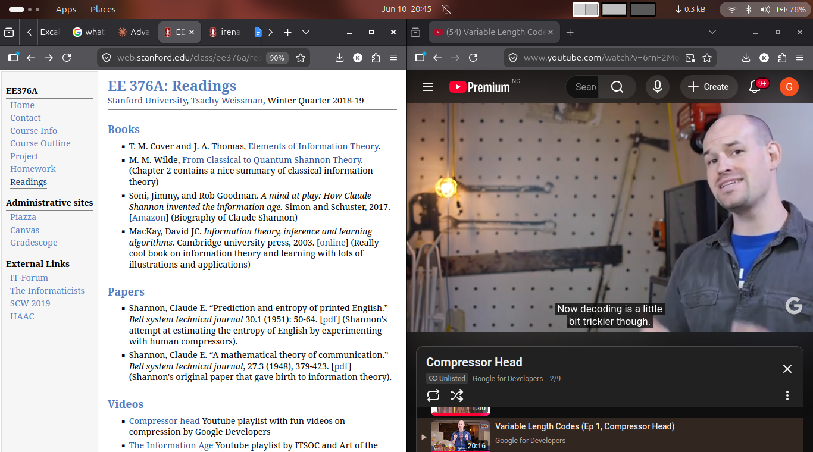

 I know this is a side note, but it's interesting for me. 

Currently watching this video, that was recommend in a Information Theory class offered at Stanford. 

Will be dropping my notes from it:

Compression head.

Samuel F.Morris
-  The fellow who thought of the idea of communicating via electric wires, leading to the invention of telegraph.
- He was definitely thinking about a way of sending natural language over a long distance using a robust medium. 
- Thus, Morse Code was born. Electric pulses were used to represent alphabet.

What happens if instead of making use of electric pulses, we used bits as represented in the computer system. 

But isn't that so long, who will memorize bit sequence for Alphabets or messages e.t.c?

Shouldn't there be a way of compressing this bits ?
Well, there is. If you assign a probability to every character symbol. Depending on the probability, you can assign a certain bit sequence to represent that character e.g. C can be represented by 0 (if it has the largest probability)

This is known as Variable length Code.

Information Theory is incomplete with Claude Shannon.
- He found a correlation between information content and the probability of that symbol occurring in the stream.
- He could determine what the information content was, in terms of binary data.
- What is the algorithm for entropy
- Entropy represents the best estimate of the minimum number of bits required to represent the stream.
- It follows the principle of assign the shortest codes to the most frequent symbols.